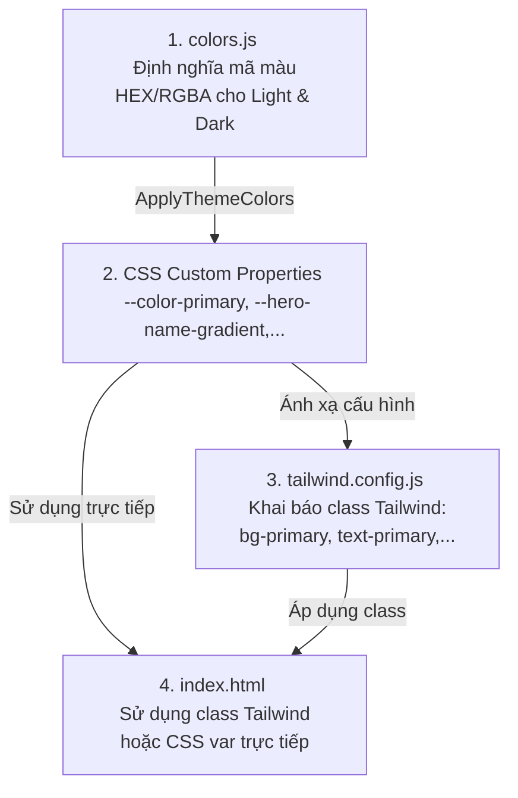

# Hướng Dẫn Sử Dụng và Cấu Hình Màu Sắc (Wedding Page)

Tài liệu này chi tiết hóa cách các biến màu sắc trong [colors.js](colors.js) được ánh xạ sang cấu hình Tailwind CSS trong [tailwind.config.js](tailwind.config.js) và được áp dụng thực tế trên trang giao diện [index.html](index.html).

---

## 💡 Cách hoạt động của hệ thống màu sắc



* **Chỉnh sửa màu**: Bạn chỉ cần chỉnh sửa mã màu Hex/RGBA trong đối tượng `THEME_PALETTES` của file [colors.js](colors.js).
* **Biên dịch lại CSS**: Sau khi thay đổi hoặc thêm token màu mới, hãy chạy lệnh dưới đây trong Terminal để biên dịch lại file CSS:
  ```bash
  npm run build:css
  ```

---

## 🎨 Chi tiết các nhóm màu & Nơi sử dụng

### 1. Bảng màu chủ đạo (Theme Palette Colors)

Được cấu hình thông qua Tailwind CSS và áp dụng rộng rãi bằng các class như `bg-{color}`, `text-{color}`, `border-{color}`.

| Tên biến CSS | Mã màu (Light / Dark) | Vai trò & Nơi sử dụng trong Web |
| :--- | :--- | :--- |
| **`primary`**<br>`--color-primary` | `#d4a3a3` / `#f1bebe` | **Màu nhấn chủ đạo (Hồng pastel / Rose gold):**<br>• Tiêu đề chính (`h2`) của các section.<br>• Tên cô dâu & chú rể ở phần giới thiệu gia đình.<br>• Màu nền nút bấm chính (Đóng Menu, Chỉ đường, Xác nhận RSVP, Gửi lời chúc).<br>• Icon trái tim trang trí.<br>• Viền tròn ảnh cô dâu chú rể (`border-primary/20`) và viền bên của thẻ Lời chúc.<br>• Màu icon điều hướng (glass-nav) ở chế độ tối. |
| **`secondary`**<br>`--color-secondary` | `#f4e4e4` / `#d7c4a4` | **Màu phụ (Hồng nhạt / Beige):**<br>• Chữ tiêu đề phụ ("PHỤ HUYNH NHÀ TRAI/GÁI") ở chế độ tối.<br>• Link menu khi hover ở chế độ tối.<br>• Màu đường gạch ngang chia đôi section Sự Kiện (`bg-secondary/50`). |
| **`tertiary`**<br>`--color-tertiary` | `#FFA1A1` / `#c5b393` | **Màu nhấn phụ (Coral / Vàng đồng):**<br>• Màu icon điều hướng (glass-nav) ở chế độ sáng.<br>• Trạng thái hover của các nút bấm chính (`hover:bg-tertiary`).<br>• Chữ tiêu đề phụ ("PHỤ HUYNH NHÀ TRAI/GÁI") ở chế độ sáng.<br>• Tiêu đề phụ trong form RSVP ("Số lượng khách"). |
| **`background`**<br>`--color-background` | `#FFF5F5` / `#131313` | **Màu nền chính trang web:**<br>• Nền toàn bộ trang (`<body>`).<br>• Nền section Sự Kiện (`#events`).<br>• Nền phần chân trang (`<footer>`). |
| **`surface`**<br>`--color-surface` | `#fff9f9` / `#131313` | **Nền bề mặt phụ:**<br>• Nền của section Album ảnh cưới (`#gallery`) ở chế độ sáng. |
| **`surfaceLowest`**<br>`--color-surface-lowest` | `#fff9f9` / `#0e0e0e` | **Nền bề mặt sâu nhất:**<br>• Nền của section Album ảnh cưới (`#gallery`) ở chế độ tối. |
| **`onBackground`**<br>`--color-on-background` | `#823C3C` / `#e5e2e1` | **Màu chữ chính:**<br>• Chữ nội dung toàn trang (đỏ đô đậm ở chế độ sáng, xám sáng ở chế độ tối).<br>• Thời gian chi tiết của sự kiện. |
| **`onSurface`**<br>`--color-on-surface` | `#823C3C` / `#e5e2e1` | **Màu chữ trên các thẻ/hộp:**<br>• Nội dung lời chúc hiển thị trong danh sách lời chúc phúc. |
| **`onSurfaceVariant`**<br>`--color-on-surface-variant` | `rgba(130, 60, 60, 0.65)` /<br>`rgba(212, 194, 194, 0.75)` | **Màu chữ phụ/mờ:**<br>• Lời trích dẫn/phụ đề dưới tiêu đề lớn (Album hình cưới, Sự kiện, RSVP).<br>• Địa chỉ chi tiết của sự kiện.<br>• Dòng bản quyền (Copyright) ở chân trang. |
| **`outline`**<br>`--color-outline` | `#D4A3A3` / `#9d8d8d` | **Màu viền & đường line ngăn cách:**<br>• Đường gạch trang trí ngắn ở phần giới thiệu.<br>• Viền của nhãn tên cô dâu & chú rể ở giới thiệu gia đình.<br>• Đường gạch ngăn cách thông tin thời gian & địa điểm.<br>• Viền dưới của các ô nhập liệu (`input`, `textarea`).<br>• Màu nhãn nổi (floating label) khi chưa được focus. |
| **`outlineVariant`**<br>`--color-outline-variant` | `#e2d1d1` / `#504444` | *Chưa dùng trực tiếp trên HTML (dự phòng cho các nét viền mảnh hơn).* |
| **`surfaceContainer`**<br>`--color-surface-container` | `#FFF5F5` / `#201f1f` | **Hộp chứa nội dung:**<br>• Màu nền thẻ thông tin sự kiện lớn ở mục Sự Kiện.<br>• Màu nền của section nhập thông tin RSVP. |
| **`card`**<br>`--color-card` | `#ffffff` / `#2a2a2a` | **Màu nền thẻ card nổi bật:**<br>• Nền của nhãn tên cô dâu/chú rể đè lên hình ảnh.<br>• Nền hộp nhập RSVP và hộp gửi Lời chúc.<br>• Nền các thẻ hiển thị lời chúc của bạn bè gửi tới. |
| **`surfaceContainerHighest`**<br>`--color-surface-container-highest` | `#ffffff` / `#353534` | **Độ nổi hộp cao nhất:**<br>• Màu viền nổi (ring border) bao quanh từng bức ảnh trong Album Cưới. |

---

### 2. Màu sắc thành phần đặc biệt (Component-Specific Custom Colors)

Được áp dụng trực tiếp qua các biến CSS (CSS Variables) trong phần thẻ `<style>` của [index.html](index.html).

#### A. Khu vực Màn hình mở đầu (Hero Section - `#home`)
* **`hero.nameGradient`** (`--hero-name-gradient`):
  * *Light:* Gradient hồng nhạt ngọt ngào.
  * *Dark:* Gradient kim loại bạc sang trọng.
  * *Sử dụng:* Làm màu chữ nghệ thuật cho tên cô dâu & chú rể lớn ở giữa màn hình.
* **`hero.nameGlow`** (`--hero-name-glow`):
  * *Light:* Hiệu ứng đổ bóng phát sáng hồng hồng.
  * *Dark:* Đổ bóng sâu màu tối kết hợp ánh hồng mờ.
  * *Sử dụng:* Giúp chữ tên cô dâu/chú rể nổi bật rõ ràng trên các hình nền slideshow.
* **`hero.ampersand`** (`--hero-ampersand`):
  * *Sử dụng:* Màu của ký tự kết nối `&` giữa hai tên.
* **`hero.ampersandGlow`** (`--hero-ampersand-glow`):
  * *Sử dụng:* Tạo độ phát sáng lấp lánh cho ký tự `&`.
* **`hero.dateText`** (`--hero-date-text`):
  * *Sử dụng:* Màu của ngày tháng cưới hiển thị dưới tên.
* **`hero.halo`** (`--hero-halo`):
  * *Sử dụng:* Vùng hào quang mờ hình tròn (radial gradient) phía sau tên giúp tăng độ tương phản với hình nền.
* **`hero.divider`** (`--hero-divider`):
  * *Sử dụng:* Đường kẻ ngang gradient trang trí dưới tên.
* **`hero.dividerGlow`** (`--hero-divider-glow`):
  * *Sử dụng:* Tạo hiệu ứng ánh kim phát sáng cho đường kẻ ngang.

#### B. Hiệu ứng Cánh hoa rơi (Falling Petals - `#petals`)
* **`petals`** (Mảng màu):
  * *Light:* `['#ffe4e1', '#fff0f5', '#ffebee']` (Hồng anh đào nhạt).
  * *Dark:* `['#f1bebe', '#613d3d', '#482728']` (Hồng phấn xen kẽ đỏ rượu vang thẫm).
  * *Sử dụng:* Script JS sẽ tự động lấy ngẫu nhiên các màu này để gán cho các cánh hoa rơi tự do trên màn hình.

#### C. Các hiệu ứng giao diện khác
* **`sectionDivider`** (`--section-divider`):
  * *Sử dụng:* Đường phân cách mờ biến mất dần ở 2 đầu nằm giữa các phần nội dung chính trên trang.
* **`musicPulse`** (`--music-pulse`):
  * *Sử dụng:* Vòng tròn sóng phát sáng tỏa ra xung quanh nút bật/tắt Nhạc nền khi đang phát nhạc.
* **`form.error`** (`--form-error`):
  * *Sử dụng:* Màu chữ hiển thị thông báo lỗi khi gửi RSVP hoặc Lời chúc thất bại.
* **`form.success`** (`--form-success`):
  * *Sử dụng:* Màu chữ hiển thị thông báo thành công khi gửi RSVP hoặc Lời chúc thành công.
* **`glass.background`** (`--glass-bg`) & **`glass.border`** (`--glass-border`):
  * *Sử dụng:* Tạo hiệu ứng kính mờ (Glassmorphism) cực kỳ sang trọng cho các nút bấm điều hướng nổi (Nút nhạc, Nút đổi giao diện sáng/tối, Nút Menu, Nút cuộn lên đầu trang).
