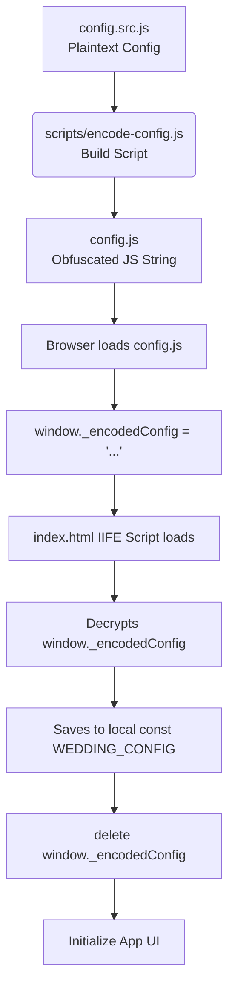

# Design Specification: Hide Configuration Details from Browser DevTools

This document describes the design for hiding sensitive/private configuration parameters of the wedding page (such as couple details, event locations, image URLs, music configurations) from casual inspection via browser Developer Tools.

## Problem Statement

Currently, the configuration for the wedding website is defined in [config.js](file:///Users/tanh/Library/CloudStorage/GoogleDrive-ghostspider2958@gmail.com/My%20Drive/Unity_Drive/K_wedding_page/config.js) as a plain JavaScript object:
```javascript
const WEDDING_CONFIG = { ... }
```
This is loaded as a global script in `index.html`:
```html
<script src="config.js"></script>
```
This approach has two main issues:
1. **Source Inspection**: The contents of `config.js` are fully visible in the "Sources" and "Network" tabs of the browser DevTools in plain text.
2. **Console Inspection**: The `WEDDING_CONFIG` constant becomes a global variable attached to the global scope (`window`), making it fully inspectable by typing `WEDDING_CONFIG` in the DevTools console.

## Proposed Solution

To mitigate these issues while keeping the application static and easy to host (e.g., on GitHub Pages), we will use client-side obfuscation and scoped execution.



### 1. Tách biệt File Cấu hình Nguồn & File Đăng tải (Build Product)

* **Source File**: [config.src.js](file:///Users/tanh/Library/CloudStorage/GoogleDrive-ghostspider2958@gmail.com/My%20Drive/Unity_Drive/K_wedding_page/config.src.js) containing the editable, plain JavaScript object. (This file will NOT be loaded directly in production).
* **Compiled File**: [config.js](file:///Users/tanh/Library/CloudStorage/GoogleDrive-ghostspider2958@gmail.com/My%20Drive/Unity_Drive/K_wedding_page/config.js) containing only the obfuscated data assigned to a temporary global variable:
  ```javascript
  window._encodedConfig = "obfuscated_string_here...";
  ```

### 2. Thuật toán làm rối / Mã hóa (XOR + Base64)

We will use a simple XOR cipher with a fixed numeric key (e.g., `42`), followed by Base64 encoding. This changes the plain text JSON into an unreadable string.
* **Encryption (Build time)**:
  `JSON String` -> `XOR with Key` -> `Base64 encode` -> `Save string to config.js`
* **Decryption (Runtime in `index.html`)**:
  `Base64 decode` -> `XOR with Key` -> `JSON.parse` -> `WEDDING_CONFIG`

### 3. Cô lập phạm vi và dọn dẹp biến tạm thời trong `index.html`

To prevent access via the DevTools console, we will:
1. Wrap all script code in [index.html](file:///Users/tanh/Library/CloudStorage/GoogleDrive-ghostspider2958@gmail.com/My%20Drive/Unity_Drive/K_wedding_page/index.html) (from line 634 to 1397) inside an **Immediately Invoked Function Expression (IIFE)**:
   ```javascript
   (() => {
       // All variables here are function-scoped and cannot be accessed from window/console.
   })();
   ```
2. Decrypt the configuration string inside the IIFE:
   ```javascript
   const decodeConfig = (str, key = 42) => {
       const binary = atob(str);
       let decoded = '';
       for (let i = 0; i < binary.length; i++) {
           decoded += String.fromCharCode(binary.charCodeAt(i) ^ key);
       }
       return JSON.parse(decoded);
   };
   ```
3. Load the configuration and immediately delete the global reference:
   ```javascript
   const WEDDING_CONFIG = decodeConfig(window._encodedConfig);
   delete window._encodedConfig;
   ```
4. This ensures that after page load, `window.WEDDING_CONFIG` is `undefined` and `window._encodedConfig` is `undefined`.

### 4. Node.js Script để Tự động Hóa (`scripts/encode-config.js`)

We will create a Node.js utility script that:
1. Imports the plaintext configuration from `config.src.js`.
2. Converts the configuration object to a JSON string.
3. Obfuscates the JSON string using XOR + Base64.
4. Writes the output script format to `config.js`.

We will register this in `package.json` under scripts:
```json
"build:config": "node scripts/encode-config.js"
```

## Verification Plan

### Manual Verification
1. Open the website. Check that the UI renders all wedding details (groom name, date, images, events) exactly as before.
2. Open DevTools:
   * **Console**: Type `WEDDING_CONFIG` and verify it returns `undefined` (or ReferenceError).
   * **Console**: Type `_encodedConfig` and verify it returns `undefined`.
   * **Sources**: Inspect `config.js` and verify it only shows the obfuscated string assignment (e.g. `window._encodedConfig = "..."`) instead of plain text keys and values.
